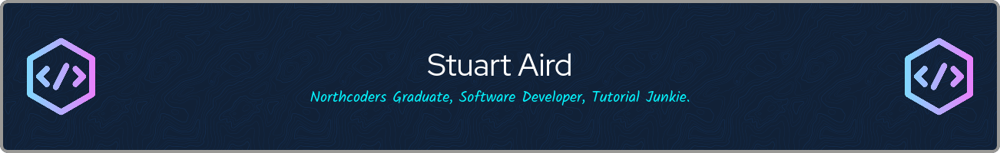

## Who am I? 
I'm a career switcher and graduate of the [Northcoders](https://northcoders.com/) full-stack bootcamp. Thanks to their mentorship and extensive syllabus, I've been happily employed as a connector developer for a uk-based iPaaS provider since 2022. 

## Current Focus
My personal development goals for this year include:-
- Completing the [CS50W](https://cs50.harvard.edu/web/2020/) and [CS50P](https://cs50.harvard.edu/python/2022/) online courses from Harvard
- Finishing my full CRUD Library API using Node.js, Express and PostgreSQL
- Hosting my Javascript based Unit Conversion API (YACT)
- Building a REST API with Python and Django

## Tech Stack
My day job and personal projects use a combination of the following:-
 

## My Downtime
On those rare occassions when I'm not coding:-
 

## Contact Details
Feel free to reach out via [email](mailto:sa-dev-work@pm.me).
